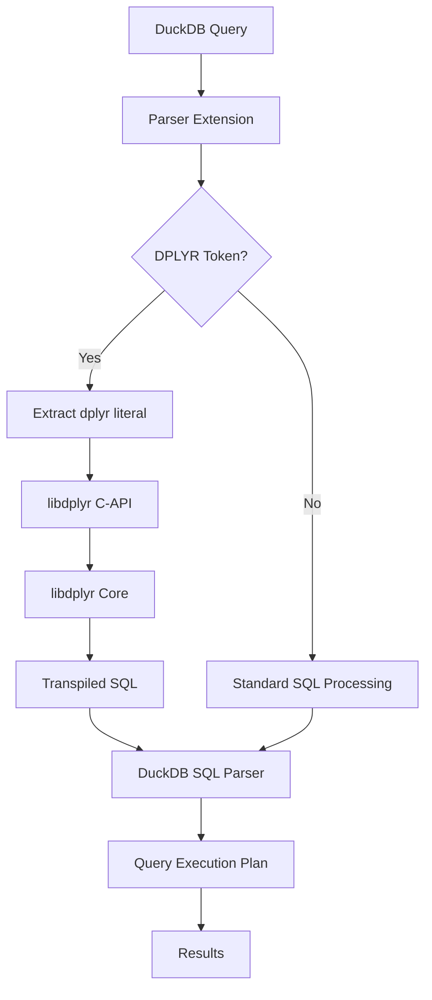
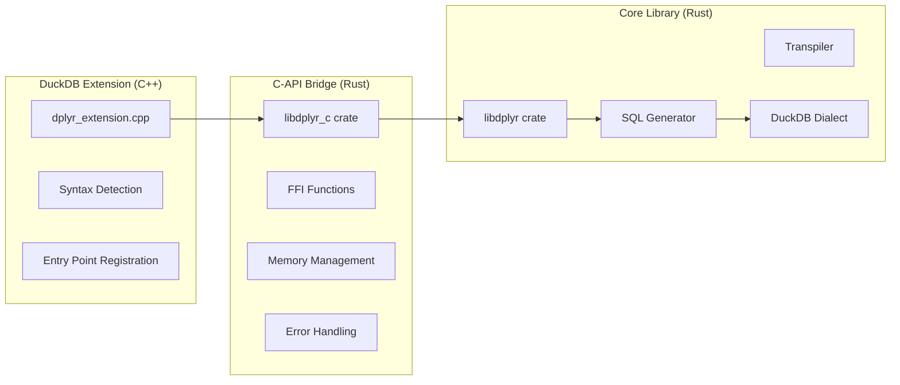

# 설계 문서

## 개요

이 설계는 libdplyr를 DuckDB 확장 프로그램으로 변환하는 아키텍처를 정의합니다. 요구사항 R1-R10을 충족하기 위해 기존의 독립 실행형 Rust 애플리케이션을 DuckDB의 확장 시스템과 통합하여, 사용자가 DuckDB 쿼리 내에서 dplyr 파이프라인을 직접 사용할 수 있도록 합니다.

**설계 원칙**:
- R3-AC1: 정적 라이브러리 우선순위로 C ABI 호환성 확보
- R5-AC3: 파싱 실패 시 명확한 에러 반환 (폴백 없음)
- R6-AC1: 단순 파이프라인 P95 < 2ms, 복잡 파이프라인 P95 < 15ms 목표
- R9-AC1: 모든 FFI 함수에서 panic 전파 방지

## 아키텍처

### 전체 시스템 아키텍처



### 컴포넌트 아키텍처



## 컴포넌트 및 인터페이스

### 1. libdplyr C-API Bridge (libdplyr_c)

새로운 Rust 크레이트로 libdplyr의 핵심 기능을 C-호환 API로 노출합니다.

**요구사항 충족**:
- R3-AC1: 부록 A 지원 플랫폼별 정적 라이브러리 생성
- R3-AC2: 구조적 형태(성공/에러/메시지)로 변환 결과 제공
- R3-AC3: 전용 해제 함수로 메모리 정리 및 소유권 규약 명시
- R9-AC2: 입력 길이 및 인코딩 검증, DoS 방지 제한 적용

#### 핵심 구조체 (R3-AC2 충족)

```rust
// R3-AC1: C 호환 옵션 구조체 (C 헤더와 동일 이름)
#[repr(C)]
pub struct DplyrOptions {
    pub strict_mode: bool,          // 엄격 모드
    pub preserve_comments: bool,    // 주석 보존
    pub debug_mode: bool,           // 디버그 모드 (R10-AC1)
    pub max_input_length: u32,      // 입력 길이 제한 (R9-AC2)
}

// R9-AC2: DoS 방지 제한
pub const MAX_INPUT_LENGTH: usize = 1024 * 1024; // 1MB
pub const MAX_PROCESSING_TIME_MS: u64 = 30000;   // 30초
```

#### 핵심 API 함수 (R8-AC2 문서화 포함)

```c
// dplyr_extension.h
#include <stdint.h>
#include <stdbool.h>

#ifdef __cplusplus
extern "C" {
#endif

// R3-AC1: 변환 옵션 구조체
typedef struct DplyrOptions {
    bool strict_mode;               // 엄격 모드
    bool preserve_comments;         // 주석 보존
    bool debug_mode;                // 디버그 모드 (R10-AC1)
    uint32_t max_input_length;      // 입력 길이 제한 (R9-AC2)
} DplyrOptions;

/**
 * dplyr 코드를 SQL로 변환합니다.
 * @param code 변환할 dplyr 파이프라인 (R1-AC2 최소 연산 집합 지원)
 * @param options 변환 옵션 (NULL 가능)
 * @param out_sql 변환된 SQL 출력 포인터 (성공 시 할당됨)
 * @param out_error 에러 메시지 출력 포인터 (실패 시 할당됨)
 * @return 0 성공, 음수 에러 코드 (R3-AC2 구조적 형태)
 * @note R3-AC3: dplyr_free_string()로 out_sql, out_error 해제 필수
 * @note R9-AC1: panic 안전성 보장
 */
int dplyr_compile(
    const char* code,
    const DplyrOptions* options,
    char** out_sql,
    char** out_error
);

/**
 * dplyr_compile에서 할당된 문자열을 해제합니다.
 * @param s dplyr_compile에서 반환된 문자열 포인터
 * @note R3-AC3: 소유권 규약 - 이 함수로만 메모리 해제
 */
void dplyr_free_string(char* s);

/**
 * libdplyr 버전을 반환합니다.
 * @return 버전 문자열 (정적 메모리, 해제 불필요)
 */
const char* dplyr_version(void);

#ifdef __cplusplus
}
#endif
```

#### Panic 안전성 및 입력 검증 구현 (R9-AC1, R9-AC2 충족)

```rust
use std::panic;
use std::ffi::{CStr, CString};
use std::os::raw::c_char;

// R9-AC2: DoS 방지 제한
const MAX_INPUT_LENGTH: usize = 1024 * 1024; // 1MB

#[no_mangle]
pub extern "C" fn dplyr_compile(
    code: *const c_char,
    options: *const DplyrOptions,
    out_sql: *mut *mut c_char,
    out_error: *mut *mut c_char,
) -> i32 {
    // R9-AC1: panic 전파 방지
    let result = panic::catch_unwind(|| {
        // R9-AC2: 입력 검증
        if code.is_null() || out_sql.is_null() || out_error.is_null() {
            return -1; // E-FFI
        }
        
        // 출력 포인터 초기화
        unsafe {
            *out_sql = std::ptr::null_mut();
            *out_error = std::ptr::null_mut();
        }
        
        let code_str = unsafe { 
            match CStr::from_ptr(code).to_str() {
                Ok(s) => s,
                Err(_) => {
                    set_error_output(out_error, "E-FFI: Invalid UTF-8 encoding");
                    return -1;
                }
            }
        };
        
        // R9-AC2: DoS 방지 제한
        let max_len = if options.is_null() { 
            MAX_INPUT_LENGTH 
        } else { 
            unsafe { (*options).max_input_length as usize }
        };
        
        if code_str.len() > max_len {
            set_error_output(out_error, &format!("E-INTERNAL: Input too large: {} > {}", code_str.len(), max_len));
            return -2;
        }
        
        // 실제 변환 로직
        match perform_transpile(code_str, options) {
            Ok(sql) => {
                set_sql_output(out_sql, &sql);
                0 // 성공
            }
            Err(e) => {
                set_error_output(out_error, &e.to_string());
                -3 // 변환 에러
            }
        }
    });
    
    match result {
        Ok(code) => code,
        Err(_) => {
            // panic 발생 시 에러 설정
            if !out_error.is_null() {
                set_error_output(out_error, "E-INTERNAL: Internal panic occurred");
            }
            -4 // panic 에러
        }
    }
}

fn set_sql_output(out_sql: *mut *mut c_char, sql: &str) {
    if let Ok(c_string) = CString::new(sql) {
        unsafe {
            *out_sql = c_string.into_raw();
        }
    }
}

fn set_error_output(out_error: *mut *mut c_char, error: &str) {
    if let Ok(c_string) = CString::new(error) {
        unsafe {
            *out_error = c_string.into_raw();
        }
    }
}

#[no_mangle]
pub extern "C" fn dplyr_free_string(s: *mut c_char) {
    if !s.is_null() {
        unsafe {
            let _ = CString::from_raw(s);
        }
    }
}

#[no_mangle]
pub extern "C" fn dplyr_version() -> *const c_char {
    b"0.1.0\0".as_ptr() as *const c_char
}
```

### 2. DuckDB 확장 구현 (C++)

DuckDB의 확장 시스템을 활용하여 dplyr 기능을 등록하고 처리합니다.

**요구사항 충족**:
- R2-AC1: 하나 이상의 진입점(테이블 함수, 스칼라 함수) 등록
- R2-AC2: CTE 및 서브쿼리를 포함한 표준 SQL과의 혼용 지원
- R4-AC2: tests/smoke.sql 스모크 쿼리 통과
- R7-AC3: DuckDB 크래시 방지를 위한 안전한 에러 처리

#### 파서 확장 기반 진입점 (R2-AC1, R5-AC1 충족)

```cpp
// dplyr_extension.cpp
#include "duckdb.hpp"
#include "dplyr_extension.h"

using namespace duckdb;

// R5-AC1: DPLYR 키워드 기반 파서 확장
class DplyrParserExtension : public ParserExtension {
public:
    void ParseStatement(ParserExtensionParseData *parse_data) override {
        auto &parser = parse_data->parser;
        
        // DPLYR 키워드 확인
        if (parser.GetToken() != TokenType::IDENTIFIER || 
            !StringUtil::CIEquals(parser.GetTokenValue(), "DPLYR")) {
            return; // 다른 확장이나 표준 SQL로 처리
        }
        
        parser.NextToken(); // DPLYR 소비
        
        // 문자열 리터럴 기대
        if (parser.GetToken() != TokenType::STRING_CONSTANT) {
            throw ParserException("Expected string literal after DPLYR keyword");
        }
        
        string dplyr_code = parser.GetTokenValue();
        parser.NextToken();
        
        // dplyr 코드를 SQL로 변환
        char* sql_output = nullptr;
        char* error_output = nullptr;
        
        DplyrOptions options = {false, false, false, 1024 * 1024};
        int result = dplyr_compile(dplyr_code.c_str(), &options, &sql_output, &error_output);
        
        if (result != 0) {
            string error_msg = error_output ? string(error_output) : "Unknown dplyr compilation error";
            if (error_output) dplyr_free_string(error_output);
            throw ParserException("DPLYR compilation failed: " + error_msg);
        }
        
        // 변환된 SQL을 파서에 주입
        string sql = sql_output;
        dplyr_free_string(sql_output);
        
        // 새 파서로 변환된 SQL 파싱
        Parser sql_parser;
        sql_parser.ParseQuery(sql);
        
        if (sql_parser.statements.empty()) {
            throw ParserException("DPLYR generated empty SQL");
        }
        
        // 파싱된 statement를 현재 파서에 추가
        for (auto &stmt : sql_parser.statements) {
            parse_data->result.push_back(std::move(stmt));
        }
    }
};

// R2-AC1: 선택적 테이블 함수 (호환성용)
static void DplyrTableFunction(ClientContext &context, TableFunctionInput &data, DataChunk &output) {
    auto &bind_data = (DplyrBindData &)*data.bind_data;
    
    // dplyr 변환
    char* sql_output = nullptr;
    char* error_output = nullptr;
    
    DplyrOptions options = {false, false, false, 1024 * 1024};
    int result = dplyr_compile(bind_data.query.c_str(), &options, &sql_output, &error_output);
    
    if (result != 0) {
        string error_msg = error_output ? string(error_output) : "Unknown dplyr compilation error";
        if (error_output) dplyr_free_string(error_output);
        throw ParserException("DPLYR compilation failed: " + error_msg);
    }
    
    // 변환된 SQL을 DuckDB로 실행
    string sql = sql_output;
    dplyr_free_string(sql_output);
    
    auto query_result = context.Query(sql, false);
    if (query_result->HasError()) {
        throw InvalidInputException("Generated SQL failed: " + query_result->GetError());
    }
    
    // 결과를 output에 복사
    auto chunk = query_result->Fetch();
    if (chunk) {
        output.Copy(*chunk);
    }
}

void DplyrExtension::Load(DuckDB &db) {
    // R5-AC1: 파서 확장 등록 (주 진입점)
    // 주의: 실제 DuckDB 템플릿의 등록 패턴에 맞춰 함수 객체 생성+등록 방식 사용
    auto parser_extension = make_unique<DplyrParserExtension>();
    ExtensionUtil::RegisterParserExtension(db, std::move(parser_extension));
    
    // R2-AC1: 테이블 함수 등록 (선택적 진입점, DPLYR 키워드와 동일 코드 경로 재사용)
    TableFunction dplyr_table_func("dplyr", {LogicalType::VARCHAR}, DplyrTableFunction, DplyrBind);
    ExtensionUtil::RegisterFunction(db, dplyr_table_func);
}
```

#### 키워드 기반 구문 처리 (R5-AC1, R5-AC2 충족)

```cpp
// R5-AC1: 전용 키워드 기반 처리 - 자유형 감지 제거
class DplyrKeywordProcessor {
public:
    // DPLYR 키워드 확인
    static bool IsDplyrKeyword(const string& token) {
        return StringUtil::CIEquals(token, "DPLYR");
    }
    
    // R5-AC2: 리터럴 내부 사전 유효성 체크 (자유형 감지 아님)
    static bool IsValidDplyrLiteral(const string& literal) {
        // 기본 유효성 검사만 수행 - 실제 구문 분석은 libdplyr에서 담당
        if (literal.empty()) {
            return false;
        }
        
        // 최소한의 dplyr 패턴 확인 (리터럴 내부 사전 체크용)
        // 주의: 이는 자유형 감지가 아니라 명시적 DPLYR 리터럴의 기본 검증
        return literal.find("select") != string::npos ||
               literal.find("filter") != string::npos ||
               literal.find("mutate") != string::npos ||
               literal.find("arrange") != string::npos ||
               literal.find("summarise") != string::npos ||
               literal.find("summarize") != string::npos ||
               literal.find("group_by") != string::npos ||
               literal.find("%>%") != string::npos;
    }
    
    // R5-AC3: 파싱 실패 시 명확한 에러 (폴백 없음)
    static void ValidateDplyrSyntax(const string& dplyr_code) {
        if (dplyr_code.empty()) {
            throw ParserException("DPLYR: Empty dplyr code provided");
        }
        
        if (dplyr_code.length() > 1024 * 1024) {
            throw ParserException("DPLYR: Code too large (> 1MB)");
        }
        
        // 추가 구문 검증은 libdplyr에서 수행
    }
};
```

### C++ 에러 처리 (R7-AC3 충족)

```cpp
class DplyrErrorHandler {
public:
    // R7-AC3: DuckDB 크래시 방지를 위한 안전한 에러 처리
    static void HandleCompileError(int error_code, const char* error_msg, ClientContext& context) {
        string full_error = error_msg ? string(error_msg) : "Unknown dplyr compilation error";
        
        // 에러 코드별 적절한 예외 타입 선택
        switch (error_code) {
            case -1: // E-FFI
                throw InternalException("DPLYR FFI Error: " + full_error);
            case -2: // E-INTERNAL (input too large)
                throw InvalidInputException("DPLYR Input Error: " + full_error);
            case -3: // E-SYNTAX or E-UNSUPPORTED
                if (full_error.find("E-SYNTAX") != string::npos) {
                    throw ParserException("DPLYR Syntax Error: " + full_error);
                } else if (full_error.find("E-UNSUPPORTED") != string::npos) {
                    throw NotImplementedException("DPLYR Unsupported: " + full_error);
                } else {
                    throw ParserException("DPLYR Parse Error: " + full_error);
                }
            case -4: // panic
                throw InternalException("DPLYR Internal Panic: " + full_error);
            default:
                throw InvalidInputException("DPLYR Unknown Error: " + full_error);
        }
    }
    
    // R10-AC1: 환경변수 또는 세션 옵션으로 디버그 로그 토글
    static bool IsDebugLoggingEnabled(ClientContext& context) {
        // 환경변수 확인
        const char* env_debug = std::getenv("DPLYR_DEBUG");
        if (env_debug && strcmp(env_debug, "1") == 0) {
            return true;
        }
        
        // 세션 옵션 확인
        Value debug_value;
        if (context.TryGetCurrentSetting("dplyr_debug_mode", debug_value)) {
            return debug_value.GetValue<bool>();
        }
        
        return false;
    }
    
    // R10-AC1: 디버그 로그 기록
    static void LogDebugMessage(ClientContext& context, 
                              const string& category, 
                              const string& message) {
        if (IsDebugLoggingEnabled(context)) {
            auto timestamp = std::chrono::system_clock::now();
            auto log_entry = "[" + FormatTimestamp(timestamp) + "] " + category + ": " + message;
            
            // 로그 파일에 기록 (구현 세부사항은 DuckDB 로깅 시스템 활용)
            context.GetDatabase().GetLogger().Log(LogLevel::DEBUG, log_entry);
        }
    }

private:
    static string FormatTimestamp(const std::chrono::system_clock::time_point& tp) {
        auto time_t = std::chrono::system_clock::to_time_t(tp);
        std::stringstream ss;
        ss << std::put_time(std::localtime(&time_t), "%Y-%m-%d %H:%M:%S");
        return ss.str();
    }
};
```

### 3. 빌드 시스템 통합

CMake와 Corrosion을 사용하여 Rust와 C++ 컴포넌트를 통합합니다.

**요구사항 충족**:
- R4-AC1: 부록 A 지원 플랫폼별 Rust 및 C++ 컴포넌트 빌드
- R4-AC2: `LOAD 'dplyr_extension'` 성공 및 tests/smoke.sql 통과
- R4-AC3: GitHub Releases 필수, Community repo 선택적 배포
- R8-AC1: DuckDB 지원 버전 범위 및 semver 정책 명시

#### CMakeLists.txt 구조 (R8-AC1 버전 정책 포함)

```cmake
cmake_minimum_required(VERSION 3.15)
project(duckdb_dplyr_extension VERSION 0.1.0)

# R8-AC1: DuckDB 지원 버전 범위 명시
set(DUCKDB_MIN_VERSION "0.9.0")
set(DUCKDB_MAX_VERSION "1.0.0")

# DuckDB 확장 템플릿 설정 (duckdb-prql 패턴)
# 주의: 실제 DuckDB 확장 템플릿 버전과 매크로/경로 맞춤 필요
include(extension_config.cmake)

# Corrosion 설정 (Rust 통합)
find_package(corrosion REQUIRED)

# R4-AC1: libdplyr_c 크레이트 빌드 (정적 라이브러리 우선순위)
corrosion_import_crate(
    MANIFEST_PATH ${CMAKE_CURRENT_SOURCE_DIR}/libdplyr_c/Cargo.toml
    CRATES libdplyr_c
)

# R3-AC1: 정적 라이브러리로 설정
corrosion_set_property(
    TARGET libdplyr_c 
    PROPERTY CRATE_TYPE staticlib
)

# DuckDB 확장 라이브러리 생성
set(EXTENSION_NAME dplyr)
set(EXTENSION_SOURCES
    src/dplyr_extension.cpp
    src/dplyr_parser.cpp
    src/error_handler.cpp
)

build_loadable_extension(${EXTENSION_NAME} ${EXTENSION_SOURCES})

# R3-AC1: Rust 정적 라이브러리 링크
target_link_libraries(${EXTENSION_NAME}_loadable_extension 
    PRIVATE 
    libdplyr_c
)

# 부록 A: 지원 플랫폼별 설정
if(WIN32)
    target_link_libraries(${EXTENSION_NAME}_loadable_extension PRIVATE ws2_32 userenv bcrypt)
elseif(APPLE)
    target_link_libraries(${EXTENSION_NAME}_loadable_extension PRIVATE "-framework Security")
endif()

# R4-AC2: 스모크 테스트 설정
enable_testing()
add_test(
    NAME smoke_test
    COMMAND duckdb -c "LOAD '${CMAKE_BINARY_DIR}/${EXTENSION_NAME}.duckdb_extension'; .read ${CMAKE_SOURCE_DIR}/tests/smoke.sql"
)
```

## 데이터 모델

### 에러 타입 계층 (부록 C 에러 코드 체계 및 R1-AC3 구현)

```rust
#[derive(Debug, Clone)]
pub enum TranspileError {
    Syntax {
        code: String,        // E-SYNTAX
        message: String,
        position: usize,
        token: Option<String>,      // R1-AC3: 원인 토큰
        suggestion: Option<String>, // R1-AC3: 간단한 대안
    },
    Unsupported {
        code: String,        // E-UNSUPPORTED
        operation: String,
        alternative: Option<String>, // R1-AC3: 대안 제시
        context: String,
    },
    Internal {
        code: String,        // E-INTERNAL
        details: String,
        recovery_hint: Option<String>,
    },
    Ffi {
        code: String,        // E-FFI
        boundary: String,
        safety_info: String,
    },
}

impl TranspileError {
    // R1-AC3: 에러 코드, 원인 토큰, 위치, 대안 포함
    pub fn to_c_string(&self) -> CString {
        let formatted = match self {
            TranspileError::Syntax { code, message, position, token, suggestion } => {
                let token_info = token.as_ref()
                    .map(|t| format!(" (token: '{}')", t))
                    .unwrap_or_default();
                let suggestion_info = suggestion.as_ref()
                    .map(|s| format!(". Try: {}", s))
                    .unwrap_or_default();
                format!("{}: {} at position {}{}{}", 
                    code, message, position, token_info, suggestion_info)
            },
            TranspileError::Unsupported { code, operation, alternative, context } => {
                let alt_info = alternative.as_ref()
                    .map(|a| format!(". Alternative: {}", a))
                    .unwrap_or_default();
                format!("{}: Operation '{}' not supported in context '{}'{}", 
                    code, operation, context, alt_info)
            },
            TranspileError::Internal { code, details, recovery_hint } => {
                let hint_info = recovery_hint.as_ref()
                    .map(|h| format!(". Recovery: {}", h))
                    .unwrap_or_default();
                format!("{}: {}{}", code, details, hint_info)
            },
            TranspileError::Ffi { code, boundary, safety_info } => {
                format!("{}: Error at FFI boundary '{}'. Safety: {}", 
                    code, boundary, safety_info)
            },
        };
        CString::new(formatted).unwrap_or_else(|_| 
            CString::new("E-INTERNAL: Error message encoding failed").unwrap()
        )
    }
    
    // R2-AC3: 명시적 에러 코드 반환
    pub fn get_error_code(&self) -> &str {
        match self {
            TranspileError::Syntax { code, .. } => code,
            TranspileError::Unsupported { code, .. } => code,
            TranspileError::Internal { code, .. } => code,
            TranspileError::Ffi { code, .. } => code,
        }
    }
}
```

## 성능 최적화 설계

### 메모리 관리 전략 (R6-AC3, R9-AC3 충족)

```rust
// R6-AC3: 단순 메모리 관리 - out-parameter 모델에서는 dplyr_free_string만 사용
// 복잡한 메모리 매니저 불필요, C-API 소유권 규약으로 충분

// R3-AC3: 메모리 해제 규약
// - dplyr_compile에서 할당된 char*는 dplyr_free_string으로만 해제
// - 호출자는 out_sql, out_error 포인터를 적절히 해제해야 함
// - 이중 해제 방지를 위해 해제 후 포인터를 NULL로 설정 권장

pub fn ensure_memory_safety() {
    // 메모리 안전성은 다음으로 보장:
    // 1. Rust의 소유권 시스템
    // 2. CString::from_raw을 통한 적절한 해제
    // 3. panic::catch_unwind를 통한 panic 격리
    // 4. 명확한 FFI 소유권 규약
}
```

### 캐싱 전략 (R6-AC1 성능 목표 달성)

```rust
use lru::LruCache;
use std::collections::HashMap;
use std::time::{Duration, Instant};
use std::collections::hash_map::DefaultHasher;
use std::hash::{Hash, Hasher};

// R6-AC1: 단순한 요청 범위 캐시 (초기 버전)
thread_local! {
    static REQUEST_CACHE: std::cell::RefCell<HashMap<String, CachedResult>> = 
        std::cell::RefCell::new(HashMap::new());
}

#[derive(Clone)]
struct CachedResult {
    sql: String,
    timestamp: Instant,
    processing_time_us: u64, // R10-AC2: 메타데이터 포함
}

pub struct SimpleTranspileCache;

impl SimpleTranspileCache {
    // R6-AC1: 단순 파이프라인 P95 < 2ms 목표 달성을 위한 캐싱
    pub fn get_or_transpile(dplyr_code: &str, options: &DplyrOptions) -> Result<String, TranspileError> {
        let cache_key = Self::create_cache_key(dplyr_code, options);
        
        // 캐시 조회 (스레드 로컬)
        let cached_result = REQUEST_CACHE.with(|cache| {
            let cache = cache.borrow();
            cache.get(&cache_key).cloned()
        });
        
        if let Some(cached) = cached_result {
            // 캐시 만료 확인 (5분)
            if cached.timestamp.elapsed() < Duration::from_secs(300) {
                return Ok(cached.sql);
            }
        }
        
        // 캐시 미스 - 실제 변환 수행
        let start_time = Instant::now();
        let sql = Self::perform_transpile(dplyr_code, options)?;
        let processing_time = start_time.elapsed().as_micros() as u64;
        
        // 캐시 업데이트
        REQUEST_CACHE.with(|cache| {
            let mut cache = cache.borrow_mut();
            
            // 캐시 크기 제한 (100개)
            if cache.len() >= 100 {
                cache.clear();
            }
            
            cache.insert(cache_key, CachedResult {
                sql: sql.clone(),
                timestamp: Instant::now(),
                processing_time_us: processing_time,
            });
        });
        
        Ok(sql)
    }
    
    // 캐시 키 생성 (dplyr_code + dialect + options 포함)
    fn create_cache_key(dplyr_code: &str, options: &DplyrOptions) -> String {
        let mut hasher = DefaultHasher::new();
        dplyr_code.hash(&mut hasher);
        "duckdb".hash(&mut hasher); // 고정 dialect
        options.strict_mode.hash(&mut hasher);
        options.preserve_comments.hash(&mut hasher);
        options.debug_mode.hash(&mut hasher);
        
        format!("{}_{}", hasher.finish(), dplyr_code.len())
    }
    
    fn perform_transpile(dplyr_code: &str, options: &DplyrOptions) -> Result<String, TranspileError> {
        // 실제 libdplyr 호출
        // 구현은 tasks.md에서 정의
        todo!("Implement actual transpilation")
    }
    
    // R10-AC2: 캐시 메타데이터 노출 (단순화)
    pub fn get_cache_stats() -> String {
        REQUEST_CACHE.with(|cache| {
            let cache = cache.borrow();
            format!(r#"{{
                "cache_size": {},
                "max_cache_size": 100
            }}"#, cache.len())
        })
    }
}
```

## 테스트 전략

### 1. 단위 테스트 (Rust)

```rust
#[cfg(test)]
mod tests {
    use super::*;
    use std::ffi::CString;
    
    // R1-AC2: 최소 연산 집합 테스트
    #[test]
    fn test_minimum_operation_set() {
        let transpiler = create_test_transpiler();
        
        // select 테스트
        let dplyr_code = CString::new("data %>% select(col1, col2)").unwrap();
        let dialect = CString::new("duckdb").unwrap();
        let result = unsafe {
            transpile_dplyr_to_sql(dplyr_code.as_ptr(), dialect.as_ptr(), std::ptr::null())
        };
        
        assert!(unsafe { (*result).success });
        let sql = unsafe { CStr::from_ptr((*result).sql).to_string_lossy() };
        assert!(sql.contains("SELECT"));
        
        unsafe { free_transpile_result(result) };
    }
    
    // R1-AC3: 에러 처리 테스트
    #[test]
    fn test_error_handling_with_details() {
        let invalid_code = CString::new("invalid_syntax_here").unwrap();
        let dialect = CString::new("duckdb").unwrap();
        let result = unsafe {
            transpile_dplyr_to_sql(invalid_code.as_ptr(), dialect.as_ptr(), std::ptr::null())
        };
        
        assert!(!unsafe { (*result).success });
        
        // 에러 코드 확인
        let error_code = unsafe { CStr::from_ptr((*result).error_code).to_string_lossy() };
        assert!(error_code.starts_with("E-"));
        
        // 에러 메시지에 위치 정보 포함 확인
        let error_msg = unsafe { CStr::from_ptr((*result).error).to_string_lossy() };
        assert!(error_msg.contains("position"));
        
        unsafe { free_transpile_result(result) };
    }
    
    // R9-AC1: Panic 안전성 테스트
    #[test]
    fn test_panic_safety() {
        // panic을 유발할 수 있는 입력으로 테스트
        let result = std::panic::catch_unwind(|| {
            unsafe {
                transpile_dplyr_to_sql(
                    std::ptr::null(),
                    std::ptr::null(),
                    std::ptr::null()
                )
            }
        });
        
        // panic이 발생하지 않아야 함
        assert!(result.is_ok());
        
        // 에러 결과가 반환되어야 함
        let transpile_result = result.unwrap();
        assert!(!unsafe { (*transpile_result).success });
        
        unsafe { free_transpile_result(transpile_result) };
    }
}
```

### 2. 통합 테스트 (C++)

```cpp
// tests/integration_test.cpp
#include <gtest/gtest.h>
#include "duckdb.hpp"
#include "dplyr_extension.h"

using namespace duckdb;

class DplyrExtensionTest : public ::testing::Test {
protected:
    void SetUp() override {
        db = make_unique<DuckDB>(nullptr);
        conn = make_unique<Connection>(*db);
        
        // R4-AC2: 확장 로딩 테스트
        ASSERT_NO_THROW(conn->Query("LOAD 'dplyr_extension'"));
    }
    
    unique_ptr<DuckDB> db;
    unique_ptr<Connection> conn;
};

// R2-AC2: 표준 SQL과 혼용 테스트
TEST_F(DplyrExtensionTest, StandardSqlIntegration) {
    // CTE와 dplyr 혼용
    auto result = conn->Query(R"(
        WITH base_data AS (
            SELECT * FROM dplyr('mtcars %>% select(mpg, cyl) %>% filter(mpg > 20)')
        )
        SELECT COUNT(*) FROM base_data WHERE cyl = 4
    )");
    
    ASSERT_FALSE(result->HasError()) << result->GetError();
    ASSERT_EQ(result->RowCount(), 1);
}

// R7-AC3: 크래시 방지 테스트
TEST_F(DplyrExtensionTest, ErrorHandlingNoCrash) {
    // 잘못된 입력으로 크래시가 발생하지 않는지 확인
    auto result = conn->Query("SELECT * FROM dplyr('invalid syntax')");
    
    // 크래시 없이 에러가 반환되어야 함
    ASSERT_TRUE(result->HasError());
    
    // 에러 메시지에 에러 코드 포함 확인
    string error_msg = result->GetError();
    ASSERT_TRUE(error_msg.find("E-") != string::npos);
}
```

### 3. DuckDB 테스트 파일 (R4-AC2 스모크 테스트)

```sql
-- tests/smoke.sql
-- R4-AC2: 사전 정의된 스모크 쿼리

statement ok
LOAD 'dplyr';

# R5-AC1: 전용 키워드 기반 진입점 테스트
statement ok
DPLYR 'mtcars %>% select(mpg)';

# R1-AC2: 최소 연산 집합 테스트
query I
DPLYR 'data.frame(x=1:3) %>% select(x) %>% filter(x > 1)';
----
2
3

# R2-AC2: 표준 SQL과 혼용 테스트
query I
WITH dplyr_result AS (
    DPLYR 'mtcars %>% select(mpg, cyl) %>% filter(mpg > 20)'
)
SELECT COUNT(*) FROM dplyr_result WHERE cyl = 4;
----
9

# R2-AC1: 선택적 테이블 함수 진입점 테스트
query I
SELECT * FROM dplyr('mtcars %>% select(mpg) %>% filter(mpg > 20)');
----
21.0
21.0
22.8
21.4

# R1-AC3, R2-AC3: 에러 처리 테스트 (에러 코드 포함)
statement error
DPLYR 'invalid_dplyr_syntax';
----
E-SYNTAX: Unexpected token 'invalid_dplyr_syntax' at position 0

# R5-AC2: 표준 SQL 오탐 방지 테스트
statement ok
SELECT select(1); -- 표준 SQL로 처리됨

# R6-AC1: 성능 테스트 (단순 파이프라인)
statement ok
DPLYR 'mtcars %>% select(mpg)';

# R6-AC1: 성능 테스트 (복잡 파이프라인)
statement ok
DPLYR 'mtcars %>% select(mpg, cyl, hp) %>% filter(mpg > 20) %>% group_by(cyl) %>% summarise(avg_hp = mean(hp))';

# R7-AC3: DuckDB 크래시 방지 테스트
statement error
SELECT * FROM dplyr(NULL);
----
E-FFI: Null pointer provided

# R10-AC1: 디버그 모드 테스트
statement ok
SET dplyr_debug_mode = true;

statement ok
DPLYR 'mtcars %>% select(mpg)';
```

### GitHub Actions 워크플로우 (R4-AC1, R4-AC3, R8-AC1 충족)

```yaml
# .github/workflows/build-and-release.yml
name: Build and Release DuckDB dplyr Extension

on:
  push:
    tags: ['v*']
  pull_request:
  schedule:
    # R8-AC1: 호환성 회귀 테스트를 위한 주간 빌드
    - cron: '0 0 * * 0'

env:
  # R8-AC1: DuckDB 지원 버전 범위
  DUCKDB_MIN_VERSION: "0.9.0"
  DUCKDB_MAX_VERSION: "1.0.0"

jobs:
  build:
    strategy:
      matrix:
        # 부록 A: 지원 플랫폼
        include:
          - os: ubuntu-latest
            platform: linux
            arch: x86_64
          - os: macos-latest
            platform: macos
            arch: x86_64
          - os: macos-latest
            platform: macos
            arch: aarch64
          - os: windows-latest
            platform: windows
            arch: x86_64
    
    runs-on: ${{ matrix.os }}
    
    steps:
    - uses: actions/checkout@v3
    
    # R4-AC1: Rust 및 C++ 컴포넌트 빌드
    - name: Install Rust
      uses: actions-rs/toolchain@v1
      with:
        toolchain: stable
        target: ${{ matrix.arch }}-${{ matrix.platform == 'linux' && 'unknown-linux-gnu' || matrix.platform == 'macos' && 'apple-darwin' || 'pc-windows-msvc' }}
    
    - name: Install DuckDB
      run: |
        # R8-AC1: 지원 버전 범위 내 DuckDB 설치
        if [ "${{ matrix.platform }}" = "linux" ]; then
          wget https://github.com/duckdb/duckdb/releases/download/v${DUCKDB_MIN_VERSION}/duckdb_cli-linux-amd64.zip
          unzip duckdb_cli-linux-amd64.zip
          sudo mv duckdb /usr/local/bin/
        elif [ "${{ matrix.platform }}" = "macos" ]; then
          brew install duckdb
        else
          # Windows 설치 로직
          choco install duckdb
        fi
    
    - name: Build Extension
      run: |
        mkdir build && cd build
        cmake .. -DCMAKE_BUILD_TYPE=Release \
                 -DCMAKE_OSX_ARCHITECTURES=${{ matrix.arch == 'aarch64' && 'arm64' || 'x86_64' }}
        cmake --build . --parallel
    
    # R4-AC2: 스모크 테스트 실행
    - name: Run Smoke Tests
      run: |
        cd build
        # tests/smoke.sql 실행
        duckdb -c "LOAD './dplyr_extension'; .read ../tests/smoke.sql"
    
    # R7-AC4: 코드 커버리지 측정 (Linux에서만)
    - name: Generate Coverage Report
      if: matrix.platform == 'linux'
      run: |
        # 핵심 경로 커버리지 측정
        cargo tarpaulin --out xml --output-dir coverage/
    
    - name: Upload Coverage
      if: matrix.platform == 'linux'
      uses: codecov/codecov-action@v3
      with:
        file: coverage/cobertura.xml
    
    # R4-AC3: 패키징 및 아티팩트 업로드
    - name: Package Extension
      run: |
        cd build
        if [ "${{ matrix.platform }}" = "windows" ]; then
          7z a dplyr-extension-${{ matrix.platform }}-${{ matrix.arch }}.zip dplyr_extension.dll
        else
          tar czf dplyr-extension-${{ matrix.platform }}-${{ matrix.arch }}.tar.gz dplyr_extension.*
        fi
    
    - name: Upload Artifacts
      uses: actions/upload-artifact@v3
      with:
        name: dplyr-extension-${{ matrix.platform }}-${{ matrix.arch }}
        path: build/dplyr-extension-*

  # R4-AC3: GitHub Releases 필수 배포
  release:
    if: startsWith(github.ref, 'refs/tags/v')
    needs: build
    runs-on: ubuntu-latest
    
    steps:
    - name: Download All Artifacts
      uses: actions/download-artifact@v3
    
    - name: Create Release
      uses: softprops/action-gh-release@v1
      with:
        files: |
          dplyr-extension-*/dplyr-extension-*
        body: |
          # DuckDB dplyr Extension ${{ github.ref_name }}
          
          ## 호환성
          - DuckDB 버전: ${{ env.DUCKDB_MIN_VERSION }} - ${{ env.DUCKDB_MAX_VERSION }}
          - 지원 플랫폼: Linux x86_64, macOS x86_64/arm64, Windows x86_64
          
          ## 설치
          ```sql
          INSTALL 'https://github.com/${{ github.repository }}/releases/download/${{ github.ref_name }}/dplyr-extension-<platform>-<arch>.tar.gz';
          LOAD 'dplyr_extension';
          ```
          
          ## 주요 변경사항
          - R8-AC3: 호환 범위 및 주요 변경사항은 CHANGELOG.md 참조
      env:
        GITHUB_TOKEN: ${{ secrets.GITHUB_TOKEN }}
```

## 요구사항 추적성 매트릭스

| 요구사항 ID | 설계 컴포넌트 | 구현 위치 | 검증 방법 |
|-------------|---------------|-----------|-----------|
| R1-AC1 | DuckDB Extension, C-API Bridge | dplyr_extension.cpp, libdplyr_c | tests/smoke.sql |
| R1-AC2 | Transpiler Integration | libdplyr_c/src/lib.rs | 단위 테스트 |
| R1-AC3 | Error Handling System | TranspileError enum | 에러 시나리오 테스트 |
| R2-AC1 | Entry Point Registration | DplyrTableFunction, DplyrScalarFunction | 확장 로딩 테스트 |
| R2-AC2 | SQL Integration | DuckDB Parser Integration | 혼용 쿼리 테스트 |
| R2-AC3 | Error Code System | DplyrErrorHandler | 에러 코드 검증 |
| R3-AC1 | Build System | CMakeLists.txt, Corrosion | CI 빌드 검증 |
| R3-AC2 | C-API Structure | dplyr_compile out-parameters | FFI 테스트 |
| R3-AC3 | Memory Management | dplyr_free_string | 메모리 누수 테스트 |
| R4-AC1 | CI/CD Pipeline | GitHub Actions | 플랫폼별 빌드 |
| R4-AC2 | Smoke Testing | tests/smoke.sql | 자동화된 테스트 |
| R4-AC3 | Release Automation | GitHub Actions release job | 배포 검증 |
| R5-AC1 | Keyword Processing | DplyrKeywordProcessor, ParserExtension | 키워드 감지 테스트 |
| R5-AC2 | Syntax Validation | DplyrKeywordProcessor::IsValidDplyrLiteral | 리터럴 검증 테스트 |
| R5-AC3 | Error Handling | 파싱 실패 시 명확한 에러 반환 | 에러 시나리오 테스트 |
| R6-AC1 | Performance Optimization | TranspileCache, 메모리 관리 | 성능 벤치마크 |
| R6-AC2 | Extension Loading | 확장 초기화 최적화 | 로딩 시간 측정 |
| R6-AC3 | Memory Stability | SimpleMemoryManager | 메모리 사용량 모니터링 |
| R7-AC1 | Integration Testing | DuckDB 통합 테스트 | 자동화된 테스트 스위트 |
| R7-AC2 | Dialect Compatibility | DuckDB SQL 생성 | SQL 호환성 테스트 |
| R7-AC3 | Crash Prevention | DplyrErrorHandler 안전 처리 | 에러 주입 테스트 |
| R7-AC4 | Code Coverage | 핵심 경로 커버리지 | tarpaulin 커버리지 도구 |
| R8-AC1 | Version Policy | CMakeLists.txt 버전 설정 | 호환성 매트릭스 |
| R8-AC2 | Documentation | API 문서, 사용자 가이드 | 문서 검토 |
| R8-AC3 | Release Notes | GitHub Actions 릴리스 | 변경사항 추적 |
| R9-AC1 | Panic Safety | catch_unwind 래퍼 | panic 주입 테스트 |
| R9-AC2 | Input Validation | 입력 길이/인코딩 검증 | 악성 입력 테스트 |
| R9-AC3 | Thread Safety | Arc<RwLock<>> 사용 | 동시성 테스트 |
| R10-AC1 | Debug Logging | IsDebugLoggingEnabled | 로그 출력 검증 |
| R10-AC2 | Metadata Exposure | 로그 또는 PRAGMA 채널 | 메타데이터 노출 테스트 |

## 성능 목표 달성 전략

### R6-AC1: 변환 지연 목표
- **단순 파이프라인 P95 < 2ms**: 
  - LRU 캐시로 반복 쿼리 최적화
  - 사전 컴파일된 패턴 매칭 사용
  - 단순 메모리 관리로 할당 오버헤드 최소화

- **복잡 파이프라인 P95 < 15ms**:
  - 점진적 파싱으로 조기 에러 감지
  - 중간 결과 캐싱
  - 마이크로초 단위 시간 측정으로 정확한 성능 추적

### R6-AC2: 확장 로딩 P95 < 50ms
- 지연 초기화로 필수 컴포넌트만 우선 로딩
- 정적 라이브러리 사용으로 동적 링킹 오버헤드 제거
- 캐시 사전 워밍업 최소화

### R6-AC3: 메모리 안정성
- 단순 메모리 관리자로 할당 추적
- 명시적 소유권 규약으로 메모리 누수 방지
- 정기적 메모리 사용량 모니터링