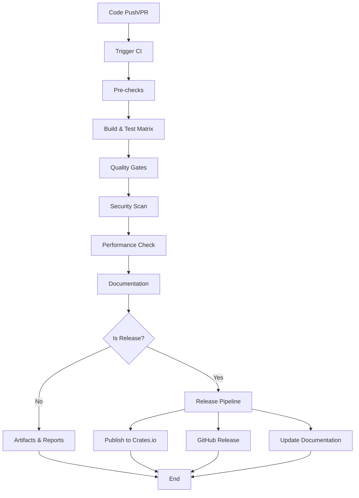

# Design Document

## Overview

libdplyr 프로젝트를 위한 포괄적인 CI/CD 파이프라인을 GitHub Actions를 기반으로 설계합니다. 현재 Go 기반 CI를 Rust 생태계에 최적화된 파이프라인으로 전환하고, 코드 품질, 보안, 성능, 배포까지 포함하는 완전 자동화된 워크플로우를 구현합니다.

## Architecture

### 파이프라인 구조



### 워크플로우 분리 전략

1. **Main CI Workflow** (`ci.yml`): 기본 빌드, 테스트, 품질 검사
2. **Security Workflow** (`security.yml`): 보안 스캔 및 의존성 검사
3. **Release Workflow** (`release.yml`): 릴리스 자동화
4. **Dependency Update** (`dependabot.yml`): 의존성 자동 업데이트

## Components and Interfaces

### 1. Main CI Pipeline (`ci.yml`)

#### Job Matrix 구성
```yaml
strategy:
  matrix:
    os: [ubuntu-latest, macos-latest, windows-latest]
    rust: [stable, beta, nightly]
    include:
      - os: ubuntu-latest
        rust: stable
        coverage: true
    exclude:
      - os: windows-latest
        rust: nightly
```

#### 주요 단계
1. **Environment Setup**
   - Rust toolchain 설치
   - 캐시 설정 (cargo registry, target directory)
   - 플랫폼별 의존성 설치

2. **Code Quality Checks**
   - `cargo fmt --check`: 코드 포맷팅 검증
   - `cargo clippy -- -D warnings`: 린팅 검사
   - `cargo doc --no-deps`: 문서 생성 검증

3. **Build and Test**
   - `cargo build --verbose`: 빌드 검증
   - `cargo test --all-features`: 전체 테스트 실행
   - `cargo test --doc`: 문서 테스트 실행

4. **Benchmark Execution**
   - `cargo bench --no-run`: 벤치마크 컴파일 검증
   - 성능 기준선 비교 (stable 브랜치에서만)

### 2. Code Coverage Integration

#### Coverage 도구 선택
- **Primary**: `cargo-tarpaulin` (Linux 환경)
- **Alternative**: `cargo-llvm-cov` (크로스 플랫폼)

#### Coverage 워크플로우
```yaml
- name: Generate Coverage Report
  if: matrix.coverage
  run: |
    cargo install cargo-tarpaulin
    cargo tarpaulin --verbose --all-features --workspace --timeout 120 --out xml
    
- name: Upload Coverage to Codecov
  if: matrix.coverage
  uses: codecov/codecov-action@v3
  with:
    file: ./cobertura.xml
    fail_ci_if_error: true
```

### 3. Security Pipeline (`security.yml`)

#### 보안 검사 도구
1. **cargo-audit**: 의존성 취약점 검사
2. **cargo-deny**: 라이선스 및 보안 정책 검증
3. **Semgrep**: 정적 코드 분석

#### 보안 워크플로우 구성
```yaml
jobs:
  security-audit:
    runs-on: ubuntu-latest
    steps:
      - name: Security Audit
        run: |
          cargo install cargo-audit
          cargo audit
          
      - name: License and Security Check
        run: |
          cargo install cargo-deny
          cargo deny check
```

### 4. Release Pipeline (`release.yml`)

#### 릴리스 트리거
- Git 태그 푸시 시 자동 실행 (`v*` 패턴)
- 수동 워크플로우 디스패치 지원

#### 릴리스 단계
1. **Pre-release Validation**
   - 전체 테스트 스위트 실행
   - 보안 검사 통과 확인
   - 버전 태그 유효성 검증

2. **Multi-platform Build**
   - Linux (x86_64, aarch64)
   - macOS (x86_64, aarch64)
   - Windows (x86_64)

3. **Artifact Generation**
   - 바이너리 압축 및 체크섬 생성
   - 릴리스 노트 자동 생성

4. **Publishing**
   - GitHub Releases 생성
   - crates.io 게시
   - 문서 업데이트

### 5. Performance Monitoring

#### 벤치마크 실행 전략
```yaml
- name: Run Benchmarks
  run: |
    cargo bench --bench transpile_benchmark | tee benchmark_results.txt
    
- name: Performance Regression Check
  run: |
    # 이전 결과와 비교하여 10% 이상 성능 저하 시 경고
    python scripts/check_performance_regression.py
```

#### 성능 메트릭 저장
- 벤치마크 결과를 GitHub Pages에 게시
- 성능 트렌드 시각화
- 성능 회귀 알림 시스템

## Data Models

### CI Configuration Structure

```yaml
# .github/workflows/ci.yml 구조
name: CI
on: [push, pull_request]
env:
  CARGO_TERM_COLOR: always
  RUST_BACKTRACE: 1

jobs:
  check:
    name: Check
    runs-on: ubuntu-latest
    steps: [...]
    
  test:
    name: Test Suite
    runs-on: ${{ matrix.os }}
    strategy:
      matrix: [...]
    steps: [...]
    
  fmt:
    name: Rustfmt
    runs-on: ubuntu-latest
    steps: [...]
    
  clippy:
    name: Clippy
    runs-on: ubuntu-latest
    steps: [...]
```

### Caching Strategy

```yaml
- name: Cache Cargo Registry
  uses: actions/cache@v3
  with:
    path: |
      ~/.cargo/registry
      ~/.cargo/git
      target
    key: ${{ runner.os }}-cargo-${{ hashFiles('**/Cargo.lock') }}
    restore-keys: |
      ${{ runner.os }}-cargo-
```

## Error Handling

### CI 실패 시나리오 처리

1. **Build Failure**
   - 컴파일 에러 상세 로그 출력
   - 의존성 문제 진단 정보 제공
   - 플랫폼별 빌드 실패 격리

2. **Test Failure**
   - 실패한 테스트 상세 정보 출력
   - 테스트 아티팩트 저장
   - 플레이키 테스트 재실행 로직

3. **Quality Gate Failure**
   - 포맷팅 문제 자동 수정 제안
   - Clippy 경고 상세 설명
   - 커버리지 부족 영역 식별

### 에러 복구 전략

```yaml
- name: Test with Retry
  uses: nick-invision/retry@v2
  with:
    timeout_minutes: 10
    max_attempts: 3
    command: cargo test --all-features
```

## Testing Strategy

### 테스트 레벨별 실행 전략

1. **Unit Tests**
   - 모든 플랫폼에서 실행
   - 빠른 피드백을 위한 병렬 실행
   - 실패 시 즉시 중단

2. **Integration Tests**
   - 주요 플랫폼에서만 실행
   - 데이터베이스 연결 테스트 포함
   - 외부 의존성 모킹

3. **Benchmark Tests**
   - Stable 브랜치에서만 실행
   - 성능 회귀 감지
   - 결과 히스토리 저장

### 테스트 환경 격리

```yaml
services:
  postgres:
    image: postgres:13
    env:
      POSTGRES_PASSWORD: postgres
    options: >-
      --health-cmd pg_isready
      --health-interval 10s
      --health-timeout 5s
      --health-retries 5
```

## Deployment Strategy

### 릴리스 채널 관리

1. **Development**: 모든 커밋에서 아티팩트 생성
2. **Beta**: 태그된 pre-release 버전
3. **Stable**: 정식 릴리스 버전

### 배포 자동화

```yaml
- name: Publish to crates.io
  if: startsWith(github.ref, 'refs/tags/v')
  run: |
    cargo login ${{ secrets.CRATES_IO_TOKEN }}
    cargo publish --dry-run
    cargo publish
```

### 롤백 전략

- 문제 발생 시 이전 버전으로 자동 롤백
- 핫픽스 브랜치를 통한 긴급 수정
- 릴리스 노트에 알려진 문제 명시

## Security Considerations

### Secrets 관리

```yaml
env:
  CRATES_IO_TOKEN: ${{ secrets.CRATES_IO_TOKEN }}
  CODECOV_TOKEN: ${{ secrets.CODECOV_TOKEN }}
```

### 권한 최소화

```yaml
permissions:
  contents: read
  security-events: write
  pull-requests: write
```

### 의존성 보안

- Dependabot을 통한 자동 업데이트
- 보안 취약점 자동 스캔
- 라이선스 호환성 검증

## Monitoring and Observability

### 메트릭 수집

1. **Build Metrics**
   - 빌드 시간 추적
   - 성공/실패율 모니터링
   - 리소스 사용량 측정

2. **Test Metrics**
   - 테스트 실행 시간
   - 커버리지 변화 추적
   - 플레이키 테스트 식별

3. **Performance Metrics**
   - 벤치마크 결과 트렌드
   - 메모리 사용량 변화
   - 성능 회귀 감지

## Scalability Considerations

### 병렬 실행 최적화

- Job 간 의존성 최소화
- 매트릭스 빌드 효율적 분산
- 캐시 전략 최적화

### 리소스 사용 최적화

- 불필요한 의존성 설치 방지
- 컴파일 캐시 적극 활용
- 아티팩트 크기 최소화

### 확장성 고려사항

- 새로운 플랫폼 지원 용이성
- 추가 품질 게이트 통합 가능성
- 외부 도구 연동 확장성